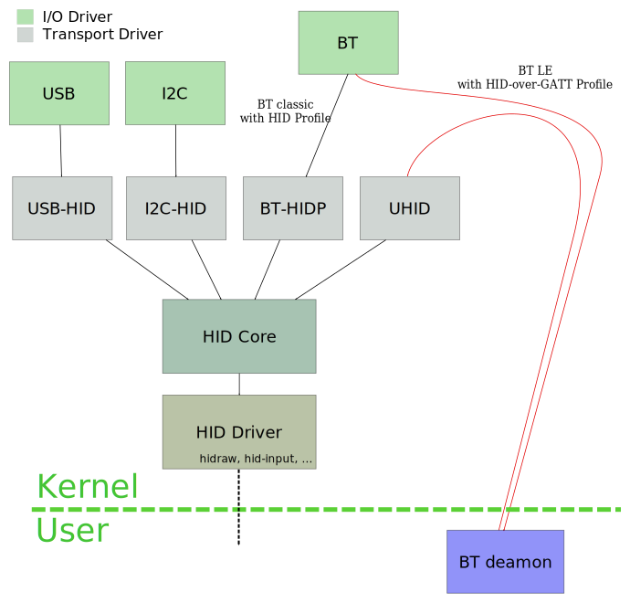

# HID-over-GATT

## HOGP

To be recognised as an HID, a device must implement the [HID-over-GATT Profile][HOGP],
which means at least the following services:

- HID.
- Battery.
- Device information.

[HOGP]: https://developer.bluetooth.org/TechnologyOverview/Pages/HOGP.aspx "HID-over-GATT Profile"

## BLE HID Service

All of the structure formats described in [HID](HID.md) are used in HID-over-GATT.

The nomenclature is not ideal, though:

- Report Map: what the USB HID calls Report Descriptor.
- Report Reference Characteristic Descriptor is the BLE way of setting a report
  characteristic's metadata. It contains the type (Input/Output/Feature)
  and ID of a report.

The HID Service defines the following characteristics:

- *Protocol Mode*: the default is Report mode, but you can change that to Boot mode.
- *Report Map*: the HID Report descriptor, defining the possible format for
  Input/Output/Feature reports.
- *Report*: a characteristic used as a vehicle for HID reports. Unlike USB, where
  the ID is sent as a prefix when there is more than one report per type, the ID
  is stored in a characteristic descriptor. This means that there will be one
  characteristic per report described in the Report Map.
- *Boot Keyboard Input Report*: when the device is a keyboard, it must define
  boot reports.
- *Boot Keyboard Output Report*.
- *Boot Mouse Input Report*.
- *HID Information*: HID version, localization and some capability flags.
- *HID Control Point*: inform the device that the host is entering or leaving suspend
  state.

Instead of USB interrupt pipes, input reports are sent using notifications.
They can also be read by the host.

## Implementation with BLE_API

A custom HID Device will need to inherit from HIDServiceBase and provide it
with a report map and the report structures.
KeyboardService is one possible implementation. As you can see in this file, it
defines a constant byte array containing the whole report map, and passes it to
HIDServiceBase during construction.

We send key reports with KeyboardService through its putc or printf
methods. For example, with `kbdService.printf("Hello world!")`, the string
"Hello world!" will go in a circular buffer, and a ticker will consume from
this buffer every 20ms.
First, the letter 'H' will be sent by writing the following values in the
inputReport characteristic:

    [0x2, 0, 0x0b, 0, 0, 0, 0, 0]
    [0, 0, 0, 0, 0, 0, 0, 0]

On the next tick, we'll send two reports for the letter 'e', and so on. 

Note that since we're
using GATT notifications, there is no way to know if the OS got the message and
understood it correctly.

## Support in common operating systems

Bluetooth Low Energy support is still at an early stage, and the HID service is
even less supported.

### Windows

Untested.

### Mac OS

The keyboard and mouse examples work on MacOSX 10.10. The OS takes complete control
over HID Services, so you can connect to a device using the bluetooth system
panel.

All tests failed on MacOSX 10.9; it seems to simply ignore all
input reports.

### iOS

Untested.

### Android

Android may be running either Bluez (see Linux), or the custom BlueDroid
implementation.
Either way, all initial tests succeeded: HID keyboard and mouse over BLE
worked great.

### Linux

[Bluez][bluez] is the way to go on Linux. Bluetooth support up until version
4.2 is in the Kernel, and userspace implementation depends on the distribution.

On Archlinux, for instance, systemd launches the Bluetooth deamon, which
communicates with the kernel driver. Any client can then send commands using
dbus. One such client is bluetoothctl, another is blueman.

I used the Bluetooth page on [the Archlinux wiki][archbt] as a starting point.
It's a good source of info about Bluez userspace.

The HID part is a bit more intricate:

* Bluetooth packets go through Bluez and Bluetooth daemon. The driver itself
  doesn't handle GATT.
* The deamon recognizes GATT packets associated with the HID Service.
* HID reports are sent to UHID (Userspace HID), and re-routed through the
  generic HID component in the kernel.
* Everything goes through the input drivers and out to the userspace again.

(Most of this diagram is courtesy of the kernel's
 Documentation/hid/hid-transport.txt)

[bluez]: http://www.bluez.org/download/ "Bluez"
[archbt]: https://wiki.archlinux.org/index.php/Bluetooth "Archlinux wiki: bluetooth"
